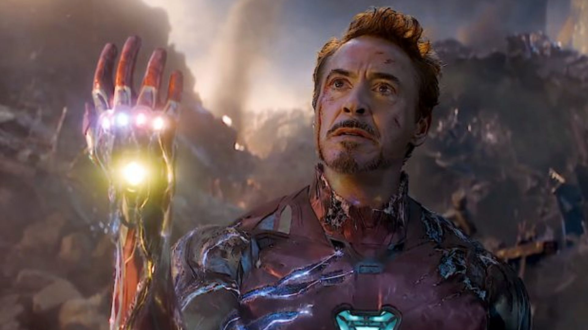
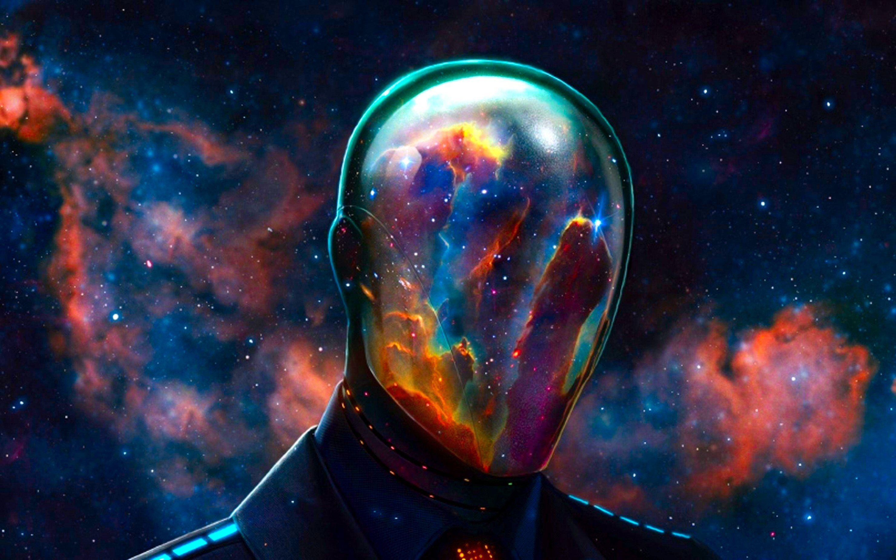
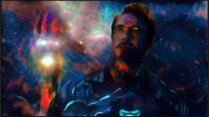

# StyleTrasfer

As described in the original paper on nueral style transfer (https://arxiv.org/pdf/1508.06576.pdf), the basic 
idea is to use nerual netwroks (specifically CNNs) to incrementally generate content from one image
in the style of another resulting in strange and fantasic works of art. I wanted to try this out for 
myself to understand it a bit better.

These were some of the experiments I ran:
- Varying image size.
- Varying learning rate.
- Relative importance of style and content losses.
- Higher weight to style loss componenets from latter layers vs. higher weight to earlier layers.
- Use content loss from shallow vs. deep layers.
- Adam vs. LBFGS optimiser.
- Initialise generated image to content image or style image rather than a white noise image.
- Standardise images.
- Effect of learning rate.
- Replace max pools with average pooling. a and beta.

As an example I wanted to generate the image of Tony Stark bravely sacrificing himself on the left, in the style of the abstract
space man on the right:

 

The result: 

